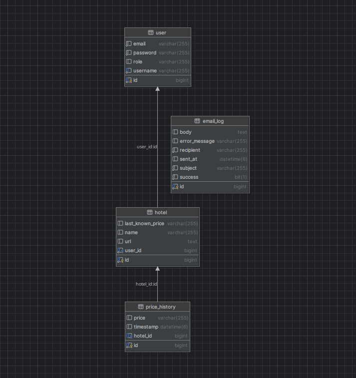

# HotelPriceAlert
Scheduled Itaka hotel price monitoring with email alerts.

---

## Overview

Hotel Price App is a full-stack application for monitoring hotel prices on **Itaka.pl** and sending alerts when prices change.  
It now also **logs all email notifications** to a dedicated `EmailLog` table for auditing purposes.

**Main features:**
- **Spring Boot** backend with REST API, Spring Security (JWT), MySQL, Jsoup scraper, and email sending.
- **React + Bootstrap** frontend with JWT authentication.
- **Automated scheduled scraping** every hour with price history logging.
- **Email logging** (`EmailLog` entity) — stores recipient, subject, body, success flag, and any error messages.

---

## Requirements

- Java 17+
- Node.js 18+
- MySQL 8+
- Maven

---

## Installation & Setup

### 1. Clone repository

git clone <repo-url>
cd HotelPriceApp
### 2. Backend configuration

Create a MySQL database:

CREATE DATABASE hotelpriceapp CHARACTER SET utf8mb4 COLLATE utf8mb4_unicode_ci;

Edit src/main/resources/application.properties:

spring.datasource.url=jdbc:mysql://localhost:3306/hotelpriceapp
spring.datasource.username=your_user
spring.datasource.password=your_password
spring.jpa.hibernate.ddl-auto=update

# JWT
jwt.secret=your_secret

# Email
spring.mail.host=smtp.yourprovider.com
spring.mail.port=587
spring.mail.username=hotel.pricealert@gmail.com
spring.mail.password=your_app_password
spring.mail.properties.mail.smtp.auth=true
spring.mail.properties.mail.smtp.starttls.enable=true

### 3. Run backend

mvn spring-boot:run

Backend runs at:

http://localhost:8080

#### 4. Frontend setup

cd frontend/hotel-price-frontend
npm install
npm start

Frontend runs at:

http://localhost:3000

# Usage

    Register/Login in the app.

    Add a hotel — paste an Itaka URL.

    Delete a hotel — click the "Delete" button on the hotel card.

    Scheduler checks prices every hour and sends email alerts.

    Every sent email is stored in the EmailLog table (including errors).

# API Endpoints (examples)
Method	Endpoint	Description
POST	/api/auth/register	Register a new user
POST	/api/auth/login	Login & get JWT
GET	/api/hotels	List user hotels
POST	/api/hotels	Add a hotel
DELETE	/api/hotels/{id}	Delete a hotel
Entities & Relationships

    User → (1:N) → Hotel

    Hotel → (1:N) → PriceHistory

    EmailLog — independent table for storing email send logs.

# Troubleshooting

    Port already in use (3000): stop other React dev servers or choose another port.

    MalformedJwtException: ensure frontend stores the token as jwt in localStorage.

    Scraper errors: check internet connection and Itaka site changes.

    Email not sending: verify SMTP credentials and enable "less secure apps" / app password.
# Database diagram
