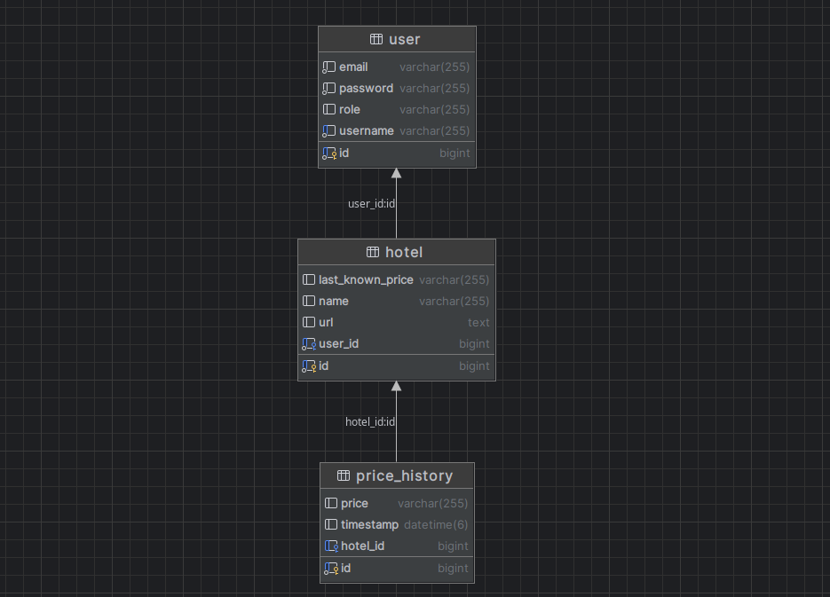

# HotelPriceAlert
Scheduled Itaka hotel price monitoring with email alerts.

# Overview

Hotel Price App is a full-stack application for monitoring hotel prices on Itaka.pl, sending alerts when prices change. It features:

    Spring Boot backend with REST API, Spring Security, MySQL, Selenium WebDriver scraper.

    React + Bootstrap frontend with JWT authentication.

    Automated scheduled scraping every hour with price history logging.

# Requirements

    Java 17+

    Node.js 18+

    MySQL 8+

    Chrome/Chromium + ChromeDriver

    Maven

# Installation & Setup
1. Clone repository

git clone <repo-url>
cd HotelPriceApp

2. Backend configuration

   Create a MySQL database:

CREATE DATABASE hotelpriceapp CHARACTER SET utf8mb4 COLLATE utf8mb4_unicode_ci;

    Set environment variables in application.properties:

spring.datasource.url=jdbc:mysql://localhost:3306/hotelpriceapp
spring.datasource.username=your_user
spring.datasource.password=your_password
jwt.secret=your_secret

    Ensure chromedriver and chromium-browser are installed.

3. Run backend

mvn spring-boot:run

Backend runs on http://localhost:8080.
4. Frontend setup

cd frontend/hotel-price-frontend
npm install
npm start

Frontend runs on http://localhost:3000.
# Usage

    Register/Login

    Add hotel: paste Itaka URL.

    Delete hotel: use “Delete” button on the card.

    Scheduler checks prices hourly and sends email alerts.

# API Endpoints (examples)
Method	Endpoint	Description
POST	/api/auth/register	Register a new user
POST	/api/auth/login	Login & get JWT
GET	/api/hotels	List user hotels
POST	/api/hotels	Add a hotel
DELETE	/api/hotels/{id}	Delete a hotel

# Troubleshooting

    Port already in use (3000): stop other React dev servers or choose another port.

    MalformedJwtException: ensure frontend stores token as jwt in localStorage.

    Scraper errors: check ChromeDriver path and browser compatibility.

# Database diagram
